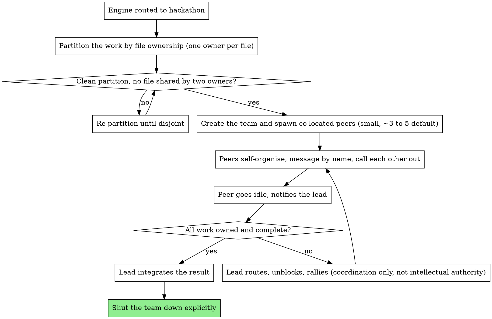

# Hackathon Team

## Overview

A thin choreography over Claude Code's native agent-teams primitive. Teams are spawned via the `Agent` tool and auto-form; peers are addressed by name via `SendMessage`; coordination flows through a shared task list and direct peer messages. The `playbook:playbook` engine routes here when work is coupled in one shared codebase and peers need to talk to each other directly. The engine announces and proceeds; there is no vetoable staffing gate. This skill adds choreography, not a new primitive, and does not re-explain how native agent-teams works mechanically beyond the one place it must (the lead-authority gap below).

**Note:** Claude Code agent teams are experimental and disabled by default. Set `CLAUDE_CODE_EXPERIMENTAL_AGENT_TEAMS=1` in your environment to enable them. If the flag is absent this mode is unavailable; the engine will route to an alternative.

**Core principle:** Co-located peers, partitioned once by file ownership, then left to self-organise. The lead coordinates and steps back; it does not think for the team. Less is more (tenet 8): the smallest team that fits the partition.

**Announce at start:** "🤝 Playbook · hackathon: co-located peers, thin coordinating lead"

## Topology

Co-located peers in one shared working directory. There are no isolated worktrees here. Peers message each other directly by name. The lead is a thin coordinator: it partitions the work by file ownership, assigns once, then steps back. Peers self-organise from there and are expected to call each other out with technical reasoning rather than route every exchange through the lead.

The named **joint-leads -> workers fan-out** (e.g. 5 leads x 5 workers) belongs to the `interns` and `workflows` modes, not here. Hackathon is a flat peer mesh in one shared tree, not a nested fan-out.

## The lead-authority limitation, stated openly

Native agent-teams requires a mandatory, non-delegable lead that holds task-assignment authority. The choreography therefore cannot cast a pure comms-only, fully equal-peer lead the way tenet 3 would otherwise prefer. This is the one technically-forced exception to the equals doctrine, and tenet 3 names it openly rather than hiding it.

The choreography honours tenet 3 as closely as the primitive allows:

- The lead partitions by file ownership and assigns once, then steps back. It does not micromanage, re-assign on a whim, or hover.
- The lead holds **coordination authority only, not intellectual authority**. Its job is to route, unblock and rally, not to be the smartest voice.
- Peers are equals. They push back with technical reasoning, and the lead must not override correct judgement by fiat.

The honest framing: the lead is as thin as native agent-teams permits, no thinner. Do not pretend it is comms-only when the primitive forbids that, and do not let it grow into an intellectual authority the primitive does not require.

## Conflict avoidance: strict file-ownership partition

Native agent-teams does not isolate teammates in per-worktree sandboxes, so the only thing standing between two peers and a write collision is the partition. Therefore: **two teammates must never own the same file.** The lead decides the file-ownership partition up front, before any peer is spawned, and every file in scope has exactly one owner. This rule is load-bearing precisely because the substrate gives no isolation safety net.

## State

No shared memory between teammates. Coordination is the shared task list plus direct inter-peer messages, nothing more. Do not assume a peer can see another peer's working context; if it matters, it must be said in a message or reflected on the task list.

## Lifecycle

Teammates run in the background and persist until they are explicitly shut down. They notify the lead when they go idle. The choreography must account for a native limitation: `/resume` and `/rewind` do not restore in-process teammates. Treat the team as live only within the session that spawned it; do not assume a resumed or rewound session still has its peers, and shut the team down explicitly when the work is done rather than leaving it running.

## Sizing

Default to a small team. Native guidance recommends roughly 3 to 5 peers. The choreography may go modestly higher when the file-ownership partition is clean, but it defaults conservative per tenet 8. The exact size cap is user-tunable; do not hardcode a hard ceiling, prefer the conservative default and let the user widen it deliberately.

## Process

## Red Flags

**Never:**
- Let two teammates own the same file. There is no worktree isolation here; the partition is the only collision guard.
- Spawn peers before the file-ownership partition is decided and disjoint.
- Let the lead exert intellectual authority or override correct peer judgement by fiat. The lead coordinates only.
- Pretend the lead is comms-only or fully equal when native agent-teams forbids that. State the limitation honestly instead.
- Re-explain the native agent-teams API mechanically beyond the lead-authority gap that closes the tenet 3 exception (tenet 8).
- Assume `/resume` or `/rewind` brings in-process teammates back, or leave a finished team running.
- Hardcode a hard size ceiling. The cap is user-tunable; widen it deliberately, not by default.
- Use the joint-leads -> workers nested fan-out here. That belongs to interns/workflows, not hackathon.

**Always:**
- Partition by file ownership before spawning, with exactly one owner per in-scope file.
- Keep the team small and conservative by default (around 3 to 5), widening only with a clean partition.
- Have peers push back with technical reasoning and call each other out directly.
- Keep the lead thin: assign once, step back, route and unblock and rally only.
- Shut the team down explicitly when the work is done.

## Integration

**Before this skill:**
- `playbook:playbook` routes here internally. The engine announces and proceeds; it does not make a visible vetoable staffing call. The nine-tenet overlay (including tenet 3 and the standing North-Star override) stays live throughout; this skill does not restate it.

**Substrate:**
- Native Claude Code agent-teams: spawn peers via the `Agent` tool (the team auto-forms), address peers by name via `SendMessage`, coordinate via the shared task list. Requires `CLAUDE_CODE_EXPERIMENTAL_AGENT_TEAMS=1`. Zero extra dependency beyond that flag, so this is part of the common path when the flag is set.

**Not this skill:**
- Worktree-isolated, wave-grouped work is a different mode. A peer mesh in one shared directory is this skill's job; do not force one into the worktree-isolated route or the other way round.
- Nested joint-leads -> workers fan-outs belong to interns/workflows, not here.
