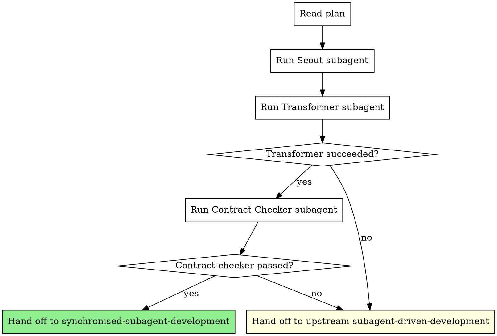

# Modifying Plans

## Overview

Take a finalised implementation plan and attempt to reshape it into a wave-grouped form that a team of parallel implementers can execute in lockstep. Plans written for serial execution often contain latent parallelism that is hidden by their sequential prose: contracts that could be extracted upfront, horizontal-mesh touches that could be isolated into a base wave, and dependent tasks that could be split into a parallel-safe stub plus a small post-merge integrate.

The skill does not invent parallelism that is not really there. It applies a small set of well-known engineering transformations and is honest when they do not apply.

**Core principle:** Transform what can be transformed. Decline what cannot. Always fall through to serial execution if transformation does not produce a confidently parallel-safe plan.

**Announce at start:** "I'm using the modifying-plans skill to attempt to reshape this plan for synchronised execution."

## When to Use

Use this skill when:

- A plan exists (from `superpowers:writing-plans` or any other source) and you intend to execute it next.
- You want to attempt synchronised parallel execution before falling back to serial.
- The plan has at least 4 tasks. Below 4, the synchronisation tax exceeds any parallel saving: skip this skill and use `superpowers:subagent-driven-development` directly.

Do not use this skill when:

- The plan has fewer than 4 tasks.
- The plan is already wave-grouped (it explicitly defines waves).
- You have no intention of running the synchronised executor afterwards, as the transformation produces a plan optimised for parallel execution and may be less natural for serial reading.

## The Process



### Step 1: Read the plan

Read the plan file once. Extract every task with its full description, file list, and dependencies as written by the plan author.

If the plan is shorter than 4 tasks, stop and hand off to `superpowers:subagent-driven-development`. The synchronisation tax does not pay back below 4 tasks.

### Step 2: Run the Scout subagent

Dispatch a fresh subagent using `./prompts/scout.md`. The Scout produces a Horizontal Mesh Manifest, a JSON document naming the shared files, hot modules, and concurrency hazards in the current repository. The manifest is the load-bearing artifact that lets the rest of this skill work in any codebase without per-project configuration.

Capture the Scout's output. Do not paraphrase it; pass it verbatim to the Transformer.

### Step 3: Run the Transformer subagent

Dispatch a fresh subagent using `./prompts/transformer.md`. The Transformer receives the full plan text and the Mesh Manifest. It returns either:

- `{status: "transformed", plan: <new plan>, contract_files: [...], wave_layout: [...]}`: the plan was reshaped into waves
- `{status: "cannot_transform", reasons: [...]}`: the plan resisted transformation

The Transformer is instructed to apply, in order:

1. **Contract extraction**: pull shared types, schemas, interfaces, and route specs into a single small Wave 0 (Contract) task that everything else depends on
2. **Mesh isolation**: route horizontal-mesh touches (files named in the Manifest) into Wave 0 alongside the contract
3. **Stub-then-integrate splitting**: when a downstream task genuinely depends on an upstream task's runtime output, split the downstream into a parallel-safe stub (Wave N) plus a small integrate step (Wave N+1)
4. **Wave grouping**: group remaining tasks into waves of up to 6 file-disjoint members each

The Transformer must refuse and return `cannot_transform` when:

- Hidden dependencies in the plan prose suggest a chain that the manifest cannot disprove
- Mesh footprint exceeds half the touched files
- Splitting into stubs would create more total work than serial execution
- Confidence on any wave's file-disjointness is low

### Step 4: Run the Contract Checker subagent

If the Transformer succeeded, the extracted contract (Wave 0) is now the load-bearing artifact for the entire synchronised run. If it is wrong, N parallel implementers in Wave 1 will build against the wrong shape.

Dispatch a fresh subagent using `./prompts/contract-checker.md`. The Contract Checker receives the original plan, the Transformer's extracted contract, the Mesh Manifest, and (crucially) the Transformer's `wave_0_touched_files` superset. It verifies:

- Every type, function signature, or route shape referenced by Wave 1+ tasks is actually defined in the contract
- The contract does not over-specify (no implementation details that should live in implementer tasks)
- The contract does not under-specify (no fields a downstream task will need but cannot find)
- The contract files do not touch any mesh hotspot in a way the Transformer missed
- **Wave 0 disjointness**: every file Wave 0 touches (including ancillary sweeps like annotation rewrites) is absent from every Wave 1+ task's `Files:` block. The Transformer's `wave_0_touched_files` enumeration is complete and accurate.
- **Wave size within cap**: every parallel wave in the layout has at most 6 tasks. A wave of 7+ tasks is a blocking issue because the synchronised executor enforces a hard cap of 6 simultaneous implementers. This cap of 6 is specific to this skill chain and is a deliberate doubling of the conservative upstream default; upstream superpowers skills use a lower number, and the two limits must not be conflated. When this skill chain is active, 6 is the cap.

If the Contract Checker returns issues, do not attempt to repair the contract here. Hand off to upstream serial. A flaky contract is more dangerous than no parallel speedup.

If the Contract Checker returns warnings (non-blocking), capture them as `accepted_warnings` to forward to the synchronised executor. Each warning records a file path the wave integration reviewer should NOT treat as a violation when it appears in a later wave's diff.

### Step 5: Hand off

**If transformation succeeded and contract check passed:**

Write the transformed plan to a sibling file next to the original: `<original-plan-path>.waves.md`. Then hand off to `playbook:synchronised-subagent-development`, passing:

- The path to the wave-grouped plan
- The Mesh Manifest verbatim
- The contract files list (`contract_files`)
- The full Wave 0 touched-files superset (`wave_0_touched_files`): this is the exclusion set the wave integration reviewer enforces against later waves
- Any `accepted_warnings` from the Contract Checker: files the wave integration reviewer should not treat as drift when they appear in later wave diffs

Include `wave_0_touched_files` and `accepted_warnings` in the plan's Manifest footer block (under the Horizontal Mesh Manifest section) so the synchronised executor can read them off the plan file.

Hand-off line (literal):

> "Mode = synchronised. Invoke skill `playbook:synchronised-subagent-development` with plan `<path>.waves.md` and manifest attached."

**If transformation failed or contract check failed:**

Hand off to upstream `superpowers:subagent-driven-development` with the original plan, untouched. Briefly state the reason transformation was declined.

Hand-off line (literal):

> "Mode = serial. Invoke skill `superpowers:subagent-driven-development` with the original plan unchanged. Reason: <one-sentence reason>."

Do not try to coax the plan into parallel shape against the Transformer's judgement. The cost of being wrong (parallel implementers colliding on shared state) far exceeds the cost of running serially.

## What the Transformations Look Like

### Contract extraction

A serial plan like:

```
Task 1: Add User schema (db/schema.ts)
Task 2: Add /users API route (server/routes/users.ts)
Task 3: Add UserCard component (web/components/UserCard.tsx)
```

Becomes, after contract extraction:

```
Wave 0 (serial): Lock User, UserResponse, UserCardProps types in types/user.ts
Wave 1 (parallel):
  Task 1a: Implement User schema against locked type
  Task 2a: Implement /users route against locked response type
  Task 3a: Implement UserCard against locked props
```

### Mesh isolation

If the Mesh Manifest flags `package.json`, `src/router/index.ts`, and `src/i18n/en.json` as shared, any task that adds a dependency, registers a route, or adds a translation gets routed into Wave 0. The remaining parallel waves only operate on files that are not in the mesh hotspot list.

### Stub-then-integrate splitting

A task like "Task 5: Wire the SSO callback into the existing auth middleware" cannot start until middleware exists, but the work of writing the SSO handler shape can. The Transformer splits it:

```
Wave N (parallel): Task 5a: Write SSO callback handler with stub middleware integration (TODO marker)
Wave N+1 (serial): Task 5b: Replace TODO marker with real middleware wiring
```

Only apply this when projected parallel saving exceeds stub overhead. Threshold: at least 3 sibling tasks in Wave N would benefit.

## Output Plan Format

A transformed plan keeps upstream's `superpowers:writing-plans` task structure inside each wave. The only additions are wave headers and a Contract section at the top.

```markdown
# [Feature Name]: Wave-Grouped Implementation Plan

> Transformed from: [original-plan-path]
> Manifest: see below
> For agentic workers: REQUIRED SUB-SKILL: playbook:synchronised-subagent-development

**Goal:** [unchanged from original]
**Architecture:** [unchanged]

---

## Contract (Wave 0, Serial)

### Task 0.1: Lock shared interfaces

**Files:**
- Create: `types/<feature>.ts`
- Modify: `[mesh hotspot files]`

[Standard upstream task steps for defining types/schemas/routes]

---

## Wave 1 (Parallel, 3 implementers)

### Task 1.1: [Name]
[Standard task body]

### Task 1.2: [Name]
[Standard task body]

### Task 1.3: [Name]
[Standard task body]

---

## Wave 2 (Parallel, 2 implementers)

[...]

---

## Horizontal Mesh Manifest (from Scout)

```json
{ ... verbatim Scout output ... }
```
```

## Known Risk: Transformer Fidelity

This is the single load-bearing claim of this skill: an LLM transformer can reliably perform contract extraction on a real plan. The transformation patterns are well-known human-engineering patterns, but having an LLM apply them correctly first-try is the actual bet.

Watch for these failure modes in real use:

- **Contract is over-specified**: includes implementation details that should live in Wave 1 tasks. Symptom: Wave 1 implementers complain that the contract leaves them no room.
- **Contract is under-specified**: omits a field or method downstream tasks need. Symptom: Wave 1 implementers ask for a type that does not exist in the contract.
- **False wave-disjointness**: two Wave-N tasks both edit a file the Manifest missed. Symptom: parallel implementers produce merge conflicts at wave-end merge.
- **Stub overhead exceeds saving**: stub-then-integrate splits created more work than running serially. Symptom: total wave time exceeds projected serial time.

If any of these show up repeatedly, the Transformer's heuristic needs work. Report the failure mode rather than papering over it.

## Red Flags

**Never:**
- Hand off to synchronised mode without a Contract Checker pass
- Attempt to repair a flaky contract, fall through to serial
- Skip the Scout step ("I know this codebase"): the Manifest is generated fresh per run because skill state is not persisted between sessions
- Transform plans of fewer than 4 tasks, synchronisation tax wins
- Treat the Transformer's `cannot_transform` as a failure to argue with, it is the right output for chain-shaped or mesh-heavy plans

**Always:**
- Pass the full plan text and full Manifest to the Transformer verbatim, do not summarise
- Write the transformed plan to disk so the synchronised executor can read it
- Print the hand-off line literally; the next skill matches on it

## Prompt Templates

- `./prompts/scout.md`: Mesh Manifest generator
- `./prompts/transformer.md`: Plan transformer
- `./prompts/contract-checker.md`: Extracted contract validator

## Integration

**Before this skill:**
- `superpowers:writing-plans`: produces the input plan
- `superpowers:using-git-worktrees`: caller may have already established an isolated workspace

**After this skill (success path):**
- `playbook:synchronised-subagent-development`: executes the wave-grouped plan

**After this skill (decline path):**
- `superpowers:subagent-driven-development`: executes the original plan serially

This skill is a router with transformation. It does not execute the plan itself.
