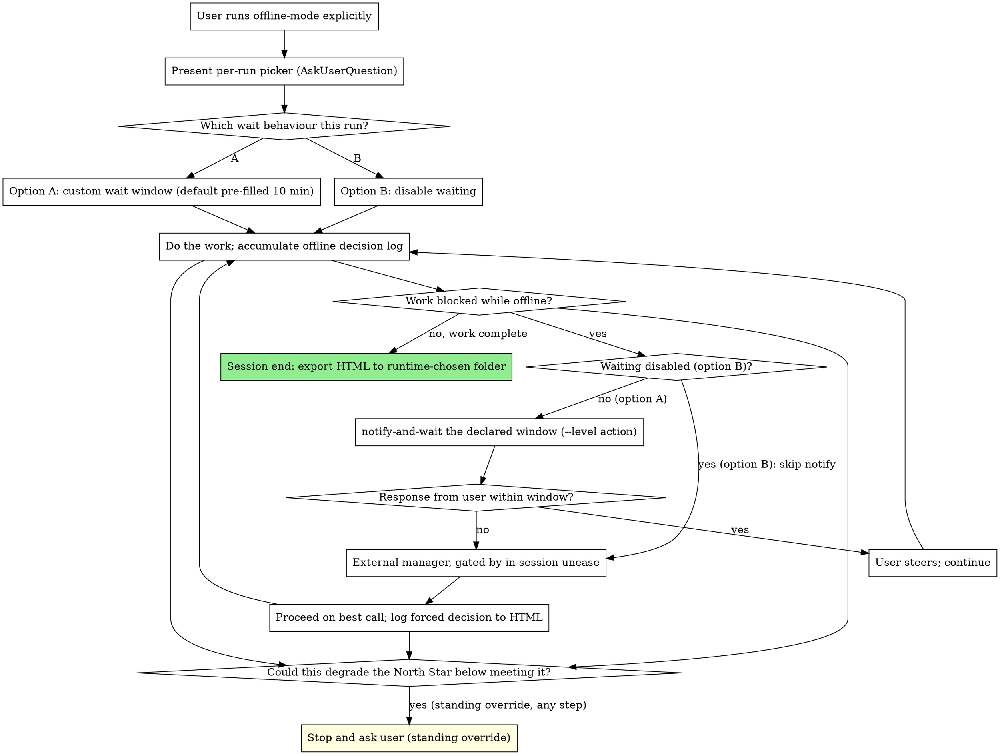

# Offline Mode

## Overview

Offline mode enables tenet 5 behaviour for a single session: a wait-then-escalate path, a push notification channel via Pushover or ntfy, and a morning-readable HTML decision log. It is reached only when the user runs it explicitly. It is never enabled implicitly, never inferred, and never carried over from a previous run.

**Core principle:** Absence is not permission. When the user is away, wait the window the user declared this run, escalate up the ladder, and only then proceed on the best call, logging every absent-decision so the user can read exactly what happened in the morning.

**Announce at start:** "📴 Playbook · offline: enabling offline behaviour for this session and declaring the wait window now."

This skill does not re-explain `AskUserQuestion`, native subagents, or the escalation ladder mechanics; it specifies only the offline-specific behaviour that closes the tenet 5 gap.

---

## Division of labour with /goal

`/goal` (native Claude Code) owns the "am I actually done?" loop. Playbook offline-mode owns:

- The North Star, carried into every step.
- The per-run wait-window picker.
- The notify pull-back.
- The escalation ladder (self, beat, research, fresh subagent, notify+wait, external manager, forced+logged).
- The morning HTML decision log.

There is no duplication between them. You may suggest pairing with `/goal` for the done-loop while offline-mode handles absence and escalation.

---

## Per-run declaration, never remembered

On every invocation, present an interactive picker (via `AskUserQuestion`) for the wait behaviour. There are exactly two options:

- **Option A, custom wait window.** A wait window during which the user is notified and the work waits for a response before proceeding. The picker's default is pre-filled at 10 minutes; the user can accept 10 minutes or set a different duration.
- **Option B, disable waiting.** No waiting; the work proceeds without holding for a response.

The choice is not persisted and is not inferred from any previous run. The user must declare it fresh every single invocation. There is no remembered default beyond the pre-filled 10 minutes shown in option A, and even that pre-fill is a starting value for the picker, not a persisted setting.

---

## Notification provider

Two providers are supported. The chosen provider is read from `.claude/playbook/notify-provider` (values: `pushover` or `ntfy`). If that file is absent but `.claude/playbook/ntfy-topic` exists, ntfy is used.

**Pushover is the recommended choice for iOS users.** Pushover holds an Apple Critical Alerts entitlement; when the user enables Critical Alerts in the app, a priority-2 message bypasses Do Not Disturb and Focus modes reliably. This is guaranteed by Apple's entitlement grant, not a best-effort signal.

**ntfy is the free, Android-friendly, and self-hostable option.** Priority 5 on ntfy bypasses DND well on Android. On iOS as of mid-2026, ntfy max priority is best-effort: Apple does not grant ntfy the Critical Alerts entitlement, so DND bypass is not guaranteed. If the user is primarily on iOS and reliable lock-screen waking matters, Pushover is the right choice.

---

## Provider setup

### First-run setup: Pushover

1. Create an account at pushover.net and note the User Key shown on the dashboard.
2. Register a new application at pushover.net/apps/build to obtain an API Token/Key.
3. Install the Pushover app on your phone and sign in.
4. In the Pushover app settings, enable Critical Alerts (High and/or Emergency) and accept the iOS prompt when it appears. Without this step, priority-2 messages will not bypass DND.
5. Save the API token to `.claude/playbook/pushover-token` (one line, no quotes).
6. Save the User Key to `.claude/playbook/pushover-user` (one line, no quotes).
7. Save `pushover` to `.claude/playbook/notify-provider`.

Both files are gitignored. From then on, `scripts/notify` reads them and sends via the Pushover API.

### First-run setup: ntfy

1. Choose a topic string (a random or memorable identifier; treat it like a password since the URL is the only access control).
2. Visit `https://ntfy.sh/<your-topic>` to confirm the endpoint exists.
3. Download the ntfy app and subscribe to that topic.
4. Save the topic string to `.claude/playbook/ntfy-topic` (one line, no quotes).
5. Optionally save a self-hosted server URL to `.claude/playbook/ntfy-server`; the default is `https://ntfy.sh`.
6. Optionally save `ntfy` to `.claude/playbook/notify-provider` (or omit it and let the script detect the topic file).

Both files are gitignored.

---

## Agent latitude and notification levels

The running agent chooses the notification level per event. The levels map as follows:

| Level | When to use | ntfy | Pushover |
|---|---|---|---|
| `info` | Progress, heads-up, non-blocking update | Priority 3 | Priority 0 |
| `action` | The user is needed to steer; work is waiting | Priority 4 | Priority 1 |
| `critical` | Genuinely urgent, warrants waking the user | Priority 5 | Priority 2 |

`critical` bypasses DND on Pushover (when Critical Alerts are enabled in the app) and is best-effort on ntfy. Use it only when the situation genuinely warrants waking the user, and state an explicit reason when you do. It is not a substitute for `action` on every notify-and-wait step.

The notify-and-wait step at the escalation ladder defaults to `action`. Escalate to `critical` only if the situation deteriorates while waiting (for example, a second notify after the first goes unanswered and the issue is time-sensitive).

---

## Decision log

While offline mode is active, accumulate a running log of events that occur specifically because the user was absent:

- Forced-without-you decisions made after the wait window elapsed.
- External-manager consultations.
- Waits.
- Notification sends (all levels).

Online runs produce no log. The log accumulates only while offline mode is active; outside an offline-mode session there is no decision log at all.

---

## HTML export

At the end of the session, render the accumulated log to a clean, simple-to-read HTML document using `decision-log.html.tmpl` in this skill directory. Save it to a folder the user chooses at runtime: either the project root, or a dedicated logs folder outside the root. The destination folder is chosen at runtime, not fixed in advance and not persisted between runs. The intent is a document the user can read calmly in the morning, so keep it legible at a glance.

---

## The escalation ladder position

Offline mode occupies the offline branches of the shared escalation ladder. The standing override sits above the entire ladder and is independent of the unease sense and the mode:

> If a decision could degrade the North Star such that the work would no longer meet it, stop and ask the user before proceeding, regardless of the unease level or the mode.

Within the ladder, when the work blocks while offline mode is active, the declared option this run decides the path:

- **Option A (a wait window was declared).** Send via `scripts/notify --level action` and hold for a response for the declared window. If a response arrives within the window, the user steers and the work continues. If the window elapses with no response, proceed on the best call and log the forced decision to the offline HTML, having consulted the external manager first where your in-session unease warrants.
- **Option B (waiting was disabled this run).** The notify-and-wait step is skipped entirely. Proceed on the best call and log the forced decision to the offline HTML, having consulted the external manager first where your in-session unease warrants. The standing North-Star override above the ladder still applies.

The ladder steps that govern the proceed-and-log path under either option:

1. **Notify the user and wait the declared window (option A only).** Send via `scripts/notify --level action` and hold for the declared window. Under option B this step is skipped entirely.
2. **External manager.** An external-model LLM with control powers over this running instance, not a same-model peer. Reached only after the notify-and-wait step (option A) or, under option B where the step is skipped, only before the forced call. Gated by your in-session unease so it is never routine. It never precedes the notify-and-wait step under option A.
3. **Forced call, logged.** Proceed with the best call and log it to the offline HTML: under option A if the declared window elapses with no response, under option B directly. The external manager is consulted first where your in-session unease warrants.

---

## The notify seam

The skill specifies a single integration point: the `scripts/notify` contract shipped with the plugin.

**Contract.** `scripts/notify [--level info|action|critical] [--link <url>] "<headline>" ["<detail>"]`. The headline is the lock-screen key action seen first (the title renders as `📚 Action: <headline>`, `📚 Info: <headline>`, or `📚 Critical: <headline>`); the optional detail is the notification body and defaults to the headline. Back-compat: `--category=action` and `--category=info` are accepted as aliases.

`--level action` (the notify-and-wait step) is an urgent push that pulls the user back to steer. `--level info` is the calmer channel for heads-up sends recorded in the decision log. `--level critical` bypasses DND; use it only when genuinely warranted and state an explicit reason.

The script is invoked at the notify-and-wait step (ladder step 1) when the work blocks while offline mode is active and option A was declared this run, and again for any further send that the decision log records. Under option B (waiting disabled) the notify-and-wait step is skipped, so `notify` is not called for the block.

**Provider selection.** `scripts/notify` reads `.claude/playbook/notify-provider` to choose between `pushover` and `ntfy`. If that file is absent but `.claude/playbook/ntfy-topic` exists, ntfy is used.

**ntfy config.** Topic at `.claude/playbook/ntfy-topic`. Optional server override at `.claude/playbook/ntfy-server` (default `https://ntfy.sh`).

**Pushover config.** App token at `.claude/playbook/pushover-token`. User key at `.claude/playbook/pushover-user`. Emergency (priority 2 / `--level critical`) requires retry and expire fields; the script sets `retry=60` and `expire=1800` automatically. A critical send returns a `receipt` token in the Pushover API response; `scripts/notify` captures it to `.claude/playbook/last-receipt` (overwritten on each critical send). Wiring this receipt into an acknowledgement-polling loop is a future step: the file is capture-only for now.

**Remote-control deep-link.** When `/remote-control` is active in the live session, the notification carries a tappable link that opens the recovered session URL straight from the lock screen (ntfy: Click header; Pushover: url field). The URL is read from the current transcript (the latest record of `type=="system"` and `subtype=="bridge_status"` whose content carries `is active`). When the bridge is inactive or absent the link is omitted: silent degradation, never a wrong link. `--link <url>` attaches an explicit URL instead.

**Exit codes.** `0` success, `3` publish failed, `4` no topic or credentials configured, `5` `curl` not installed, `64` usage error. The skill should react meaningfully when a send fails rather than swallowing it.

---

## Process

---

## Red Flags

**Never:**
- Enable offline mode implicitly, by inference, or by carrying over a previous run. It is explicit, per run, every time.
- Remember or persist the picker choice across runs, or infer it from a previous run. The user must declare it fresh every invocation.
- Produce a decision log on an online run. Online absence means blocked and we wait; the log accumulates only while offline mode is active.
- Treat the notify seam as optional under option A. When a wait window was declared, the notify-and-wait is the offline block path and every send is a logged event.
- Fire the notify-and-wait under option B. When waiting was disabled this run, that step is skipped entirely.
- Reach the external manager before the notify-and-wait step under option A, or treat it as routine. It is gated by your in-session unease.
- Fix the HTML export destination in advance or persist it. The folder is chosen at runtime, project root or an external logs folder.
- Bypass the standing North-Star override because a wait window is running. The override sits above the entire ladder.
- Use `--level critical` routinely or without an explicit stated reason. It wakes the user; reserve it for situations that genuinely warrant that.

**Always:**
- Declare the wait behaviour fresh every run via the per-run picker, option A custom window (default pre-filled 10 minutes) or option B disable waiting.
- Log every forced-without-you decision, external-manager consultation, wait, and notification send while offline mode is active.
- Notify via `scripts/notify --level action` and wait the declared window before any external-manager step, unless waiting was disabled this run.
- Consult the external manager first, where your in-session unease warrants, before a forced call.
- Export the HTML decision log to the folder the user chooses at runtime at session end, morning-readable.
- Apply the standing North-Star override at every step, independent of the unease sense and the mode.
- State an explicit reason when escalating to `--level critical`.

---

## Integration

**Before this skill:**
- `playbook:playbook` is the routing engine. It restates the North Star, batches questions, and routes. It routes here only when the user explicitly enables offline behaviour for tenet 5; offline mode is never implicit. The nine-tenet overlay and the standing North-Star override stay live throughout; this skill does not restate the overlay.

**Division of labour:**
- `/goal` owns the "am I actually done?" loop. This skill owns absence, escalation, and the morning log. Suggest pairing with `/goal` when the task has a clear completion criterion.

**The shared escalation ladder:**
- Offline mode occupies the offline branches of the same ladder used by tenets 3, 4, and 5: notify-and-wait the declared window, then the external manager gated by your in-session unease, then the forced call logged to the offline HTML.

**The notify seam:**
- `scripts/notify [--level info|action|critical] [--link <url>] "<headline>" ["<detail>"]` sends to the user's phone via the configured provider. Topic or credentials live in `.claude/playbook/`; the Click or url field deep-links back to `/remote-control` when it is active, otherwise omitted.

**Substrate:**
- Native Claude Code plus `curl`. `AskUserQuestion` drives the per-run picker; native subagents handle the external-manager consultation; `scripts/notify` ships with the plugin. No further dependency: still part of the common path.
