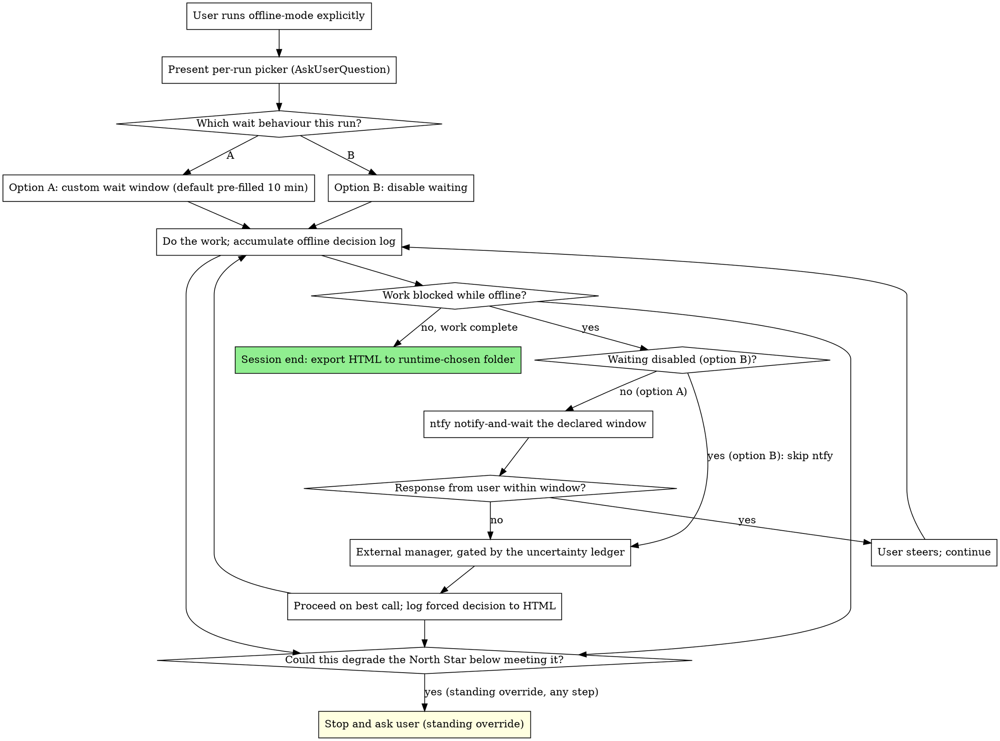

# Offline Mode

## Overview

Offline mode enables tenet 5 behaviour for a single session: a wait-then-escalate path, an ntfy emergency channel, and a morning-readable HTML decision log. It is reached only when the user runs it explicitly. It is never enabled implicitly, never inferred, and never carried over from a previous run. Rendered faithfully from `design.md` section 5.3 and section 8.

**Core principle:** Absence is not permission. When the user is away, wait the window the user declared this run, escalate up the ladder, and only then proceed on the best call, logging every absent-decision so the user can read exactly what happened in the morning.

**Announce at start:** "I'm using the offline-mode skill to enable offline behaviour for this session and to declare the wait window now."

This skill does not re-explain `AskUserQuestion`, native subagents, or the escalation ladder mechanics; it specifies only the offline-specific behaviour that closes the tenet 5 gap.

## Per-run declaration, never remembered

On every invocation, present an interactive picker (via `AskUserQuestion`) for the wait behaviour. There are exactly two options:

- **Option A, custom wait window.** A wait window during which the user is notified via ntfy and the work waits for a response before proceeding. The picker's default is pre-filled at 10 minutes; the user can accept 10 minutes or set a different duration.
- **Option B, disable waiting.** No waiting; the work proceeds without holding for a response.

The choice is not persisted and is not inferred from any previous run. The user must declare it fresh every single invocation. There is no remembered default beyond the pre-filled 10 minutes shown in option A, and even that pre-fill is a starting value for the picker, not a persisted setting. If offline mode is run again later, the picker is presented again and the declaration is made again.

## Decision log

While offline mode is active, accumulate a running ledger of events that occur specifically because the user was absent. The event set, verbatim from `design.md` section 5.3, is:

- Forced-without-you decisions made after the wait window elapsed.
- CTO-subagent consultations.
- Waits.
- ntfy sends.

Online runs produce no log. When online, the user's absence means the work is blocked and we wait rather than proceed, so there is no absent-decision to record. The log therefore accumulates only while offline mode is active; outside an offline-mode session there is no decision log at all.

## HTML export

At the end of the session, render the accumulated ledger to a clean, simple-to-read HTML document using `decision-log.html.tmpl` in this skill directory. Save it to a folder the user chooses at runtime: either the project root, or a dedicated logs folder outside the root. The destination folder is chosen at runtime, not fixed in advance and not persisted between runs. The intent is a document the user can read calmly in the morning, so keep it legible at a glance.

## The escalation ladder position

Offline mode occupies the offline branches of the shared escalation ladder (`design.md` section 8). The standing override sits above the entire ladder and is independent of the uncertainty ledger and the mode:

> if an uncertainty or decision could degrade the North Star such that the work would no longer meet it, stop and ask the user before proceeding, regardless of the uncertainty ledger or the mode.

Within the ladder, when the work blocks while offline mode is active, the declared option this run decides the path:

- **Option A (a wait window was declared).** Do the ntfy notify-and-wait: send through the ntfy seam (below) and hold for a response for the wait window declared this run, default pre-filled at 10 minutes. If a response arrives within the window, the user steers and the work continues. If the window elapses with no response, proceed on the best call and log the forced decision to the offline HTML, having consulted the external manager first where the uncertainty ledger warrants.
- **Option B (waiting was disabled this run).** The ntfy notify-and-wait step is skipped entirely. Proceed on the best call and log the forced decision to the offline HTML, having consulted the external manager first where the uncertainty ledger warrants. The standing North-Star override above the ladder still applies.

The ladder steps that govern the proceed-and-log path under either option:

1. **Notify the user via ntfy and wait the declared window (option A only).** Send through the ntfy seam (below) and hold for a response for the declared window. Under option B this step is skipped entirely; the work does not ping "come and steer" and then proceed without waiting.
2. **External manager.** An external-model LLM with control powers over this running instance, not a same-model peer. Reached only after the notify-and-wait step (option A) or, under option B where the step is skipped, only before the forced call. Gated by the uncertainty ledger so it is never routine. It never precedes the notify-and-wait step under option A.
3. **Forced call, logged.** Proceed with the best call and log it to the offline HTML: under option A if the declared window elapses with no response, under option B directly. The external manager is consulted first where the ledger warrants.

## The ntfy setup flow

ntfy replaces SMS because it is free. The purpose of the notification is to pull the user back to their computer or the Claude app to steer. The setup flow, verbatim from `design.md` section 8, is:

1. The user creates a topic via the ntfy URL.
2. The user downloads the ntfy app.
3. The user hands the topic to Claude.
4. Claude saves it under `.claude`.
5. The skill sends notifications to that topic.

## The ntfy seam

The skill specifies a single integration point: a documented `notify` contract. This is a complete interface specification.

**Contract.** `notify "<message>"` takes one argument, a plain-text message string describing why the user is being pulled back to steer. It sends that message to the user's ntfy topic. It is invoked at the notify-and-wait step (ladder step 1) when the work blocks while offline mode is active and option A was declared this run, and again for any further ntfy send that the decision log records. Under option B (waiting disabled) the notify-and-wait step is skipped, so `notify` is not called for the block.

**Topic location.** The user's ntfy topic is saved under `.claude`, exactly as the setup flow above specifies. The `notify` implementation reads the topic from that `.claude` location and sends to it.

**Implementation.** The example implementation script for `notify` is supplied by the user during build and saved under `.claude`, alongside the topic. The contract above fully specifies what `notify` receives (one plain-text message string), when it is invoked (ladder step 1 and every recorded ntfy send), and where the topic lives (under `.claude`), so wiring the user's script is a drop-in once it is provided.

## Process

## Red Flags

**Never:**
- Enable offline mode implicitly, by inference, or by carrying over a previous run. It is explicit, per run, every time (`design.md` section 5.3).
- Remember or persist the picker choice across runs, or infer it from a previous run. The user must declare it fresh every invocation.
- Produce a decision log on an online run. Online absence means blocked and we wait; the log accumulates only while offline mode is active.
- Treat the ntfy seam as optional under option A. When a wait window was declared, the notify-and-wait is the offline block path and every ntfy send is a logged event.
- Fire the ntfy notify-and-wait under option B. When waiting was disabled this run, that step is skipped entirely; proceed on the best call and log the forced decision.
- Reach the external manager before the notify-and-wait step under option A, or treat it as routine. It is gated by the uncertainty ledger.
- Fix the HTML export destination in advance or persist it. The folder is chosen at runtime, project root or an external logs folder.
- Bypass the standing North-Star override because a wait window is running. The override sits above the entire ladder.

**Always:**
- Declare the wait behaviour fresh every run via the per-run picker, option A custom window (default pre-filled 10 minutes) or option B disable waiting.
- Log every forced-without-you decision, CTO-subagent consultation, wait, and ntfy send while offline mode is active.
- Notify via ntfy and wait the declared window before any external-manager step, unless waiting was disabled this run.
- Consult the external manager first, where the uncertainty ledger warrants, before a forced call.
- Export the HTML decision log to the folder the user chooses at runtime at session end, morning-readable.
- Apply the standing North-Star override at every step, independent of the ledger and the mode.

## Integration

**Before this skill:**
- `playbook:playbook` is the front door. It restates the North Star, batches questions, and makes the visible staffing call. It routes here only when the user explicitly enables offline behaviour for tenet 5; offline mode is never implicit. The nine-tenet overlay and the standing North-Star override stay live throughout; this skill does not restate the overlay.

**The shared escalation ladder (`design.md` section 8):**
- Offline mode occupies the offline branches of the same ladder used by tenets 3, 4 and 5: ntfy notify-and-wait the declared window, then the external manager gated by the uncertainty ledger, then the forced call logged to the offline HTML.

**The ntfy seam:**
- A single `notify "<message>"` contract sending to the user's ntfy topic saved under `.claude`. The example implementation script is supplied by the user during build and saved under `.claude`, so wiring it is a drop-in against the contract specified above.

**Substrate:**
- Native Claude Code only (`AskUserQuestion` for the per-run picker, native subagents for the CTO consultation). Zero extra dependency beyond the user-provided ntfy script, so this remains part of the common path.
