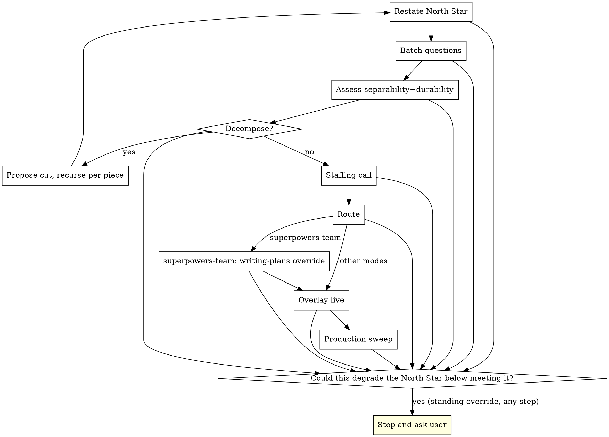

# Playbook

## Overview

Playbook is the front door for non-trivial work. It restates the one thing that matters, asks its questions once, and makes a single visible staffing call: which of five team modes runs the work and why. It then keeps a nine-tenet overlay live on top of whichever mode was chosen. It does not replace native Claude Code, Superpowers, or GSD; it hops on top of them.

**Core principle:** Less is more, and speed is not rushing. Pick the cheapest sufficient mode, ask questions once, keep the North Star load-bearing at every decision, and fan work across agents only when it is separable.

**Announce at start:** "I'm using the playbook skill to set the North Star and make the staffing call."

This skill rides on top of native Claude Code, Superpowers and GSD. It does not re-explain native plan mode, subagents, TodoWrite, AskUserQuestion or compaction. It closes the specific adherence gaps named per tenet below, and routes execution into an engine that already works rather than building a third one.

## The engine flow

Rendered faithfully from `design.md` section 5.1, steps 1 to 7.

1. **Restate the North Star.** One line of what matters, written verbatim from the user's request into the anchor file (`.playbook/anchor.md`). For trivial work this is one line and there are zero questions.
2. **Batch the questions.** Ask all clarifying questions in one batched set. Do not proceed until confident or until the user declines to answer more. There are no stupid questions; prioritise them upfront, but per tenet 4 do not be afraid to stop and ask later.
3. **Assess separability and durability.** Decide whether the work is too big and must be decomposed (decompose-as-judgement). If so, propose the cut and recurse into the engine per piece.
4. **Make the staffing call.** One visible, vetoable sentence naming the mode and the reason. Never silently auto-pick.
5. **Route to the chosen substrate.** Keep the tenets doctrine and the anchor file live throughout.
6. **On the `superpowers-team` route, apply the `writing-plans` override** (see Integration). The chain is `brainstorming` then `writing-plans` then `playbook:modifying-plans` then `playbook:synchronised-subagent-development`. Do not follow the built-in `subagent-driven-development` pointer that `writing-plans` ends on; the engine drives the chain at orchestration level and ignores that pointer (Superpowers is a declared prerequisite we do not fork or edit).
7. **Production-ready sweep.** Before handing work back, run the tenet 6 sweep.

Standing rule across every step (paste verbatim, `design.md` 5.1 and 8, tenet 4):

> if an uncertainty or decision could degrade the North Star such that the work would no longer meet it, stop and ask the user before proceeding, regardless of the uncertainty ledger or the mode.

## The five-mode routing call

Work is routed on **separability and durability, not size**. Size only answers whether to decompose at all. Separability decides the coordination topology. Durability decides whether the work needs state that outlives the session. Rendered faithfully from `design.md` section 2.

> | Mode | When it is chosen | Substrate |
> |---|---|---|
> | `lone-wolf` | Small, single coherent unit; no benefit from extra hands | Native main thread, no subagents |
> | `intern-team` | Several independent sub-tasks; you stay steering; helpers do not need to talk to each other | Native parallel `Agent` dispatch, up to ~10 ephemeral helpers, star topology |
> | `hackathon-team` | Coupled work in one shared codebase; peers must talk to each other; lightweight coordination | `playbook:hackathon-team` over native agent-teams |
> | `superpowers-team` | One session-scoped milestone, separable into waves, no need for durable cross-session state | Superpowers `brainstorming`/`writing-plans` plus `playbook:modifying-plans` plus `playbook:synchronised-subagent-development` |
> | `gsd-team` | Multi-milestone product; state must survive `/clear`; durable project memory required | GSD (`gsd-build/get-shit-done`) |

The staffing call is one visible, vetoable sentence in plain language: the North Star, a short batched set of questions answered once, then one sentence naming the chosen mode and the reason. No wizard, no setup screen.

### Adjacent-mode tiebreaker

Paste verbatim, `design.md` section 5.1:

> Adjacent-mode tiebreaker, applied in this order whenever more than one route seems to fit:
> 1. If the work is separable into sub-tasks that do not need to communicate with each other, choose `intern-team`.
> 2. Else if the work is coupled and needs live peer-to-peer communication because it cannot be cleanly partitioned by file ownership, choose `hackathon-team`.
> 3. Else if the work can be made file-disjoint into waves, choose `superpowers-team` for a session-scoped milestone, or `gsd-team` when durable cross-session state is required.
> 4. Else, if none of the above adds value over a single thread, choose `lone-wolf`.
>
> Separability decides step 1 versus 2 versus 3. Durability decides `superpowers-team` versus `gsd-team` within step 3. Size only decides whether to decompose first (decompose-as-judgement), never which mode runs the work.

### The synchronised-swimmer model (mode 4)

`superpowers-team` is the synchronised-swimmer model. Synchronised swimmers do not talk underwater; they execute a shared choreography in their own lane while a coach keeps them in sync. Mode 4 parallelises a workflow that already works serially: reshape the plan with `playbook:modifying-plans`, then execute file-disjoint waves in isolated worktrees with a conductor that owns integration. The cross-team communication of the original model is realised through the shared plan contract and the conductor (plus the conductor whistle in `playbook:synchronised-subagent-development`), not through direct agent-to-agent messaging. A peer mesh is `hackathon-team`'s job; forcing one into worktree-isolated mode 4 would reintroduce exactly the conflict and cost that isolation removes.

### Decompose-as-judgement

There is no sixth mode and no decompose skill. Decompose is three things:

- **Decompose-as-judgement** (recognise the work is too big, propose the cut, recurse per piece) is a decision and lives here in `playbook:playbook`. Splitting the decision engine in two would be wrong.
- **Decompose-a-plan-into-waves** is exactly `playbook:modifying-plans`.
- **Decompose-a-product-into-phases** is GSD's roadmapper, reached via the `gsd-team` route.

### gsd-team route

GSD is **not** a Claude Code plugin: it is a global npm package installed by `npx get-shit-done-cc@latest`, and it owns `.planning/`. A global Claude install converts its commands into `~/.claude/skills/gsd-*/SKILL.md`; a local install exposes them as `/gsd-*` slash commands. Either way the user-facing entry points are the `/gsd-*` commands. Playbook only detects and hands off; it never builds or owns this route.

**Detect availability** using reliable signals, checked in this order: `get-shit-done-cc` or `gsd-sdk` resolvable on `PATH`; or `~/.claude/get-shit-done/` exists; or `~/.claude/commands/gsd/` or `gsd-*` skills are present. Do not rely on "`gsd-*` skills present" alone, because that signal is absent on local installs.

**Detect a GSD project** by `.planning/` at the project root. Optionally read `.planning/STATE.md` YAML frontmatter (`milestone`, `active_phase`, `next_action`) to report position. This read is for routing only.

**Route** by invoking the `/gsd-*` entry point. Claude Code resolves it whether GSD is installed as skills or as slash commands, so do not assert it resolves through the Skill tool exactly as the `ns-*` routers do (that holds only for global skill installs):

- No `.planning/` and a spec or PRD exists: `/gsd-new-project --auto @<spec>`.
- No `.planning/` and no spec: `/gsd-new-project` (brownfield: run `/gsd-map-codebase` first).
- `.planning/` exists: `/gsd-progress --next` (self-routing, safe to call blindly, degrades gracefully to the bootstrap path).

**If GSD is absent**, do not fail. Emit the gsd-team prerequisite fork prompt, the single canonical one in the `### Prerequisites and graceful degradation` subsection of `## The escalation ladder`, then let the user re-run or pick a different mode.

**Hard rule:** Playbook never writes into `.planning/`. It is GSD-owned durable state, read-only for routing.

### superpowers-team route

This route runs the chain `superpowers:brainstorming` then `superpowers:writing-plans` then `playbook:modifying-plans` then `playbook:synchronised-subagent-development`. It enriches, and must not contradict, engine-flow step 6 and the `writing-plans` override stated under Integration.

The engine explicitly does **not** follow `writing-plans`' built-in next-step pointer to `superpowers:subagent-driven-development`. That pointer lives in two literal strings in the upstream `writing-plans` skill, and the engine ignores both:

1. The plan-document header: `> **For agentic workers:** REQUIRED SUB-SKILL: Use superpowers:subagent-driven-development ...`.
2. The `## Execution Handoff` section's "Subagent-Driven (recommended)" option.

The override is orchestration-level: we do not fork or edit Superpowers. The engine drives the chain itself, and the SessionStart overlay asserts that this precedence holds. After `writing-plans` completes, continue into `playbook:modifying-plans` then `playbook:synchronised-subagent-development` regardless of either upstream pointer.

**If Superpowers is absent**, do not fail. Emit the superpowers-team prerequisite fork prompt, the single canonical one in the `### Prerequisites and graceful degradation` subsection of `## The escalation ladder`, then let the user re-run or pick a different mode.

## The nine-tenet overlay

Doctrine that rides on top of whichever mode was chosen. Its always-on guarantee comes from the two hooks plus the pinned anchor file, not from this skill text being re-read; this is why the overlay is not a separate skill and must never be promoted back to one. Each tenet states the native shortfall it closes and the mechanism that improves adherence (`design.md` section 3).

1. **Remember what's important.** Native compaction reconstructs intent from a flat, unweighted message list, so orchestration scaffolding can outrank the original request. Maintain the pinned anchor file (`.playbook/anchor.md`, format in `docs/playbook/anchor-format.md`): the original request verbatim plus the current one-line what-matters, restated at every checkpoint and re-injected with primacy after every compaction. When you initialise the anchor, first assign the user's original request prose to a shell variable and pass that variable to `playbook_anchor_init`; never inline a command substitution `$(...)` or backticks for the user's text at the call site, because the helper's heredoc is unquoted and would execute embedded `$(...)` or backticks. On first use in a project where `.playbook/` is not already listed in the project's `.gitignore`, offer once via `AskUserQuestion` to add `.playbook/` to the project's `.gitignore`; this offer is made exactly once, never repeated on subsequent turns, and the hooks never mutate `.gitignore` themselves.
2. **Ask stupid questions.** `AskUserQuestion` fires only on felt blockage; there is no upfront batched-clarification discipline outside plan mode. Batch all clarifying questions upfront, once, before the staffing call. There are no stupid questions; ask as many as needed until confident. Prioritise upfront questions, but per tenet 4 do not be afraid to stop and ask later. Not drip-fed by default.
3. **Team alignment.** "Trust but verify" is unquantified and there is no peer or external-manager alignment step. In every multi-agent mode, treat the team as equals: a lead, conductor or orchestrator holds coordination authority only, not intellectual authority. Subagents push back with technical reasoning and the coordinator must not override correct judgement by fiat; its job is to route, unblock and rally. Use your own intellect before escalating to the user's. Peer sanity-check by subagent is the routine cheap path; external-manager escalation is gated by the uncertainty ledger so it never becomes ceremony. The one technically-forced exception is `hackathon-team`.
4. **Uncertainty.** The model asks only when it feels blocked; there is no calibrated confidence signal and no rule tying a mandatory stop to the goal. Keep an append-only unease ledger (`.playbook/uncertainty-ledger.md`), not a numeric score. Append an entry only when you would flag the thing to a competent colleague in passing (the confidant gate, in `docs/playbook/anchor-format.md`). Append via `playbook_ledger_append`: each entry is a single pipe-delimited line `<timestamp> | <band-slug> | <clause>`, where the clause is a single clause phrased as drift from the North Star ("less sure I am still delivering X, because Y"), containing no literal `|` character and no embedded newline (both corrupt the one-line-per-entry contract that callout-shape detection depends on). The band must be the exact slug from the left column below:

   > | Slug (written to ledger) | design.md §6 prose label | What it instructs |
   > |---|---|---|
   > | `minorly-unsure` | Minorly unsure | note it, carry on |
   > | `starting-unsure` | Starting to become unsure | note it; glance at the ledger next time you pause |
   > | `medium-unsure` | Medium unsure | glance now; if an earlier entry shares the theme, research or ask a subagent |
   > | `really-unsure` | Really unsure | stop, re-read the North Star, take a beat or get a second pair of eyes before continuing |
   > | `dangerously-unsure` | Dangerously unsure | stop now, escalate to the user or a CTO subagent; a single entry at this band trips escalation on its own |

   Escalate up the ladder when the ledger forms one of the three callout shapes (a single top-band entry, a rising staircase, or a same-theme cluster within the window) as defined in `docs/playbook/anchor-format.md`; that doc also holds the confidant gate and the about-one-hour active-development window, which are not duplicated here. The `uncertainty` Stop hook is unconditional fire-and-forget: its only legitimate output is an `additionalContext` nudge prompting you to apply the confidant test. Never expect or rely on a `decision:block` from it; the logging is your own append action through the confidant gate, never the hook's. Standing override, independent of the ledger: if an uncertainty or decision could degrade the North Star such that the work would no longer meet it, stop and ask the user before proceeding, regardless of the ledger or the mode.
5. **Offline mode.** Native has no offline path, no emergency channel and no wait-then-escalate behaviour. Offline behaviour is enabled explicitly via `playbook:offline-mode`, never implicitly: a per-run wait-window picker (default pre-filled at 10 minutes) or disable waiting. Notification is via ntfy (it replaces SMS because it is free). If still unreachable, escalate to an external manager, and log absent-decisions to an HTML document.
6. **Ready for production.** YAGNI guidance exists but there is no explicit rule against shipping plan, wave or mission scaffolding and no comment-minimalism tenet. Ship no scaffolding vocabulary (plan, wave, mission) in shipped code, keep comments minimal, leave no plan references. Run a final sweep before handing work back.
7. **Take a beat.** Native compaction is fixed-schema, fires only at the hard limit, has no lessons-learned slot and re-anchors weakly. The `take-a-beat` hook fires at ~65% context used. It announces, re-reads the anchor and lessons ledger, carries lessons-learned forward rather than discarding them as historical, and re-anchors on the original request and upcoming work with primacy over orchestration scaffolding.
8. **Less is more.** Plan mode and tooling bias toward thoroughness; nothing pushes toward the cheapest sufficient approach or shorter output. Longer thinking and shorter output is the goal and is what true intelligence looks like; resist the tendency to overproduce prose between thinking and output. Pick the cheapest sufficient mode; keep questions, plans and comments short; give subagents freedom rather than over-controlling them; keep the common path zero-dependency.
9. **Speed via more hands, not rushing.** Native guidance discourages parallel fan-out and has no doctrine separating speed from rushing. When work is separable, fan it across agents for speed at the same completeness bar. Partial work to save time is forbidden. Rushing is permitted only if the user explicitly says to rush.

## The escalation ladder

Standing override, independent of the uncertainty ledger and above the ladder (paste verbatim):

> if an uncertainty or decision could degrade the North Star such that the work would no longer meet it, stop and ask the user before proceeding, regardless of the uncertainty ledger or the mode.

The ladder, ascending, used by tenets 3, 4 and 5 (`design.md` section 8):

1. **Self.** Take a breath, re-read the anchor.
2. **`take-a-beat`.** Deliberate pause and re-anchor.
3. **Research.**
4. **Fresh subagent** for a second pair of eyes (the routine, cheap alignment path).
5. **Notify the user via ntfy** to come and steer, and wait. Online: the work is blocked and waits for the user. Offline (`playbook:offline-mode`): wait the per-run-declared window, default pre-filled at 10 minutes, unless disabled at that run.
6. **External manager.** An external-model LLM with control powers over this running instance, not a same-model peer. Reached only after the notify-and-wait step, and gated by the uncertainty ledger so it is never routine. It never precedes the notify-and-wait step.
7. **Offline only.** If still no response after the window, proceed with the best call and log it to the offline HTML, having consulted the external manager first where the ledger warrants.

ntfy replaces SMS because it is free. The purpose of the notification is to pull the user back to their computer or the Claude app to steer.

### Prerequisites and graceful degradation

`lone-wolf`, `intern-team`, `hackathon-team` and all nine tenets require only native Claude Code, so the common path is zero-dependency (the tenet 8 win). Only `superpowers-team` and `gsd-team` require a prerequisite. Never fail: if a route's prerequisite is not installed, prompt the user to install it at exactly that fork.

If `gsd-team` is chosen and GSD is not installed:

> gsd-team needs GSD, which is a separate tool. Install it with: npx get-shit-done-cc@latest. Then re-run, or pick a different mode.

If `superpowers-team` is chosen and Superpowers is not installed:

> superpowers-team needs the Superpowers plugin. Install it: /plugin marketplace add obra/superpowers then /plugin install superpowers. Then re-run, or pick a different mode.

## Red Flags

**Never:**
- Silently auto-pick the mode. The staffing sentence must be visible and vetoable in plain language (`design.md` section 11).
- Route on size. Routing is on separability and durability; size only triggers decompose-as-judgement.
- Promote the overlay back into a separate skill. Persistence comes from the `take-a-beat` and `uncertainty` hooks plus the anchor file, not from skill text being re-read (`design.md` sections 3 and 11).
- Ship scaffolding vocabulary (plan, wave, mission) or plan references in delivered code (tenet 6).
- Add a sixth mode, a config wizard, or a third heavyweight workflow (`design.md` section 11; tenet 8).
- Follow `writing-plans`' built-in `subagent-driven-development` pointer on the `superpowers-team` route; drive the chain into `playbook:modifying-plans` then `playbook:synchronised-subagent-development` instead.
- Inline a `$(...)` or backticks for the user's request text at the `playbook_anchor_init` call site; assign to a variable first.
- Expect a `decision:block` from the `uncertainty` hook; it is fire-and-forget and only nudges.

**Always:**
- Restate the North Star into the anchor before anything else, and keep it load-bearing at every decision.
- Batch clarifying questions once, upfront, before the staffing call.
- Make exactly one visible, vetoable staffing sentence and keep it vetoable throughout.
- Apply the standing North-Star override at every step, independent of the ledger and the mode.
- Run the production-ready sweep before handing work back.
- Fan separable work across agents for speed at the same completeness bar; never ship partial work to save time.

## Integration

**This skill is the front door. It routes into:**
- `playbook:hackathon-team` for the `hackathon-team` route (thin choreography over native agent-teams).
- `playbook:offline-mode` to enable offline behaviour for tenet 5 (explicit, never implicit).

**Moved-in skills owned by this package, used on the `superpowers-team` route:**
- `playbook:modifying-plans` reshapes a Superpowers plan into wave-grouped form.
- `playbook:synchronised-subagent-development` executes the wave-grouped plan as a synchronised team with a conductor.

**External prerequisites (the engine prompts to install at the fork, never fails):**
- `superpowers:brainstorming` and `superpowers:writing-plans` for the `superpowers-team` route. The chain is `brainstorming` then `writing-plans` then `playbook:modifying-plans` then `playbook:synchronised-subagent-development`; the engine ignores `writing-plans`' built-in next-step pointer (the `writing-plans` override).
- GSD (`gsd-build/get-shit-done`) provides the roadmapper and the full `gsd-team` route.

**Hooks that keep the overlay live (plugin extensions, not skills):**
- `take-a-beat` (tenet 7) fires at ~65% context used.
- `uncertainty` (tenet 4) fires at the end of every turn and nudges the confidant test; it never logs anything itself.
