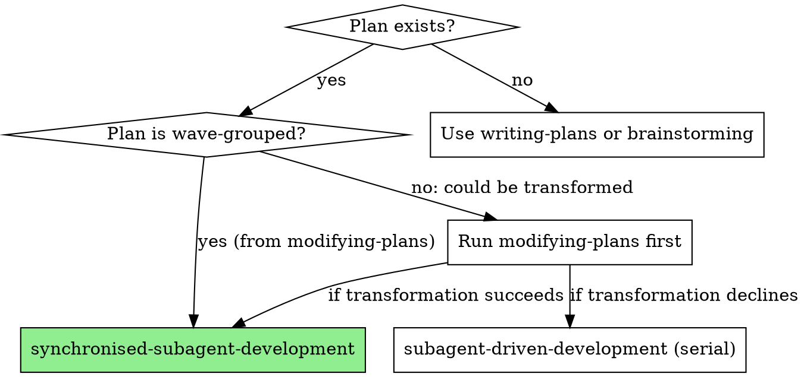
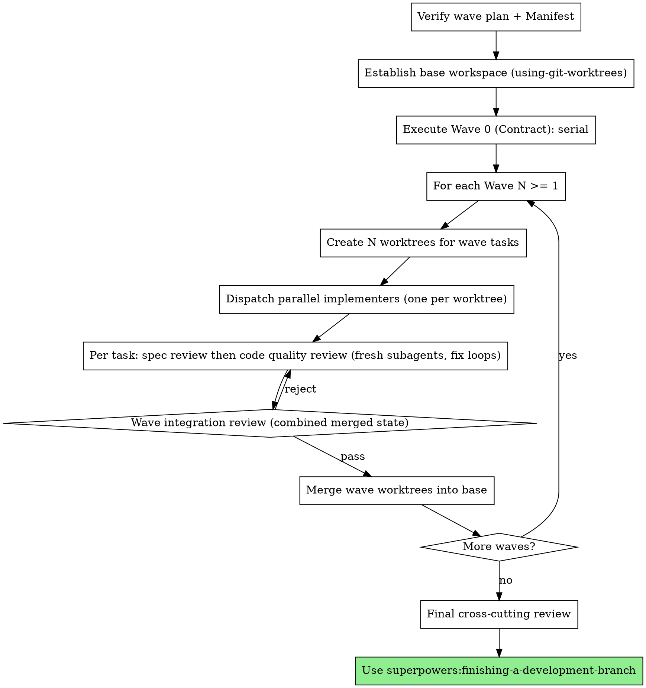

# Synchronised Subagent-Driven Development

Execute a wave-grouped plan by dispatching a synchronised team of implementer subagents (each in its own isolated git worktree) that move in lockstep, wave by wave. Per-task review is preserved verbatim from upstream `superpowers:subagent-driven-development`. A wave-level integration review is added at each wave boundary to catch cross-implementer collisions that per-task review cannot see.

**Core principle:** Synchronised swimmers, not a one-man-band. Each implementer has a defined role, a known timing, and a separate worktree. The conductor enforces lockstep checkpoints. Reviews are layered: per-task (kept from upstream) for correctness, per-wave (new) for integration.

**Why parallel dispatch is safe here:** The Contract Checker has already proven that the tasks within a wave are file-disjoint, and Phase 2a gives each implementer its own worktree with its own private index and branch. Implementers operate only on their own worktree and never touch the shared integration branch, so there is no shared git state for them to race; the conductor owns the integration branch. There is therefore no parallel-safety hazard for you to discover at execution time, because the hazards were eliminated upstream by construction. If at any point you find yourself reasoning that parallel work is risky and that serial would be safer, you have either skipped the worktree setup that Phase 2a requires, or you are inventing a blocker. Both are violations of this skill, not prudent caution.

**Continuous execution:** Do not pause to check in with the human between tasks or between waves. Execute the entire plan without stopping. The only reasons to stop are: BLOCKED status the team cannot resolve, ambiguity that genuinely prevents progress, or all waves complete.

**Announce at start:** "I'm using the synchronised-subagent-development skill to execute this wave-grouped plan."

## When to Use

**Use when:**
- Plan was produced by `playbook:modifying-plans` with `status: "transformed"` and a passing Contract Check
- Plan has a `Contract (Wave 0, Serial)` section followed by one or more `Wave N (Parallel, ...)` sections
- A Horizontal Mesh Manifest is available (passed in by `modifying-plans` or attached to the plan)
- The harness supports parallel `Task()` dispatch and `using-git-worktrees` (native or fallback)

**Don't use when:**
- Plan is not wave-grouped → use `superpowers:subagent-driven-development` or run `playbook:modifying-plans` first
- No Manifest available → run `playbook:modifying-plans` (which generates one) or fall through to serial
- Fewer than 4 tasks total → use `superpowers:subagent-driven-development`

## Team Structure

| Role | How Spawned | Persistence | Count |
|------|------------|-------------|-------|
| Conductor (you) | Main agent | Session lifetime | 1 |
| Wave Implementer | Fresh `Task()` per task, in own worktree | Single task | 1 per parallel task in current wave (hard cap 6) |
| Spec Reviewer | Fresh `Task()` | Single review | 1 per task per review pass |
| Code Quality Reviewer | Fresh `Task()` | Single review | 1 per task per review pass |
| Wave Integration Reviewer | Fresh `Task()` | Single wave | 1 per wave |

Implementers are NOT persistent across tasks. Cycle 2 of the design exploration established that persistent implementers degrade by task 5-6 due to context bloat, contamination, and drift. Each task gets a fresh implementer in a fresh worktree.

Reviewers are also fresh per pass. Upstream's "do not trust the implementer's report" pattern requires uncontaminated review context.

**Parallelism cap: 6 per wave, and this number is specific to this skill.** This skill uses a hard cap of 6 simultaneous implementers per wave. That is a deliberate doubling of the conservative upstream superpowers default. Do not confuse the two: when this skill is active the cap is 6, and any lower number stated by an upstream superpowers skill does not apply here. Equally, do not carry the 6 back to upstream skills. A wave produced by `modifying-plans` will already be sized to this cap; your job is to dispatch the whole wave in parallel, not to second-guess its size downward.

## The Process

### Phase 0: Setup

1. **Verify the plan is wave-grouped.** The plan must have a `Contract (Wave 0, Serial)` section and at least one `Wave N (Parallel, ...)` section. If not, this is the wrong skill: fall through to `superpowers:subagent-driven-development`.

2. **Verify a Mesh Manifest is available.** Either inline in the plan or passed by `modifying-plans`. The Manifest's `concurrency_hazards` and `shared_files` lists are required for the Conductor's wave-merge logic.

3. **Establish the base workspace** using `superpowers:using-git-worktrees`. The base workspace is where Wave 0 will execute and where all later wave worktrees will branch from. The base ends on a single branch (the integration branch for this plan).

4. **Extract all wave-grouped tasks.** Read the plan once. Build a TodoWrite list with every task across all waves. Note each task's wave number and its `Files:` block.

### Phase 1: Wave 0: Contract (Serial)

Execute Wave 0 as a single-task serial run, in the base workspace. This is identical to upstream `subagent-driven-development` for one task:

1. Dispatch implementer using `./prompts/implementer.md` with `worktree_mode: "base"` (work in the base workspace).
2. Spec review using `./prompts/spec-reviewer.md`. Fix loop until pass.
3. Code quality review using `./prompts/code-quality-reviewer.md`. Fix loop until pass.
4. Mark Wave 0 complete. Commit lives on the integration branch.

If Wave 0 fails to converge after two fix loops, escalate. The contract is the foundation of every subsequent wave; do not proceed with a flaky contract.

### Phase 2: For Each Wave N ≥ 1

#### Step 2a: Create per-task worktrees

For each task in the wave, create an isolated worktree branched from the current state of the integration branch. Branch names: `<integration-branch>-wave<N>-task<task-id>`.

If the harness provides a native worktree tool (e.g. `EnterWorktree`), use it per the rules in `superpowers:using-git-worktrees` Step 1a. Otherwise use `git worktree add` per Step 1b.

If worktree creation fails for any task in the wave (sandbox denial, disk space, etc.), do not proceed with a partial wave. Either retry, or degrade this wave to serial execution in the base workspace.

#### Step 2b: Dispatch parallel implementers

Make ONE message that contains N parallel `Task()` calls, one per wave task. Each implementer's prompt uses `./prompts/implementer.md` with:

- `worktree_mode: "isolated"`
- `worktree_path: <the worktree created for this task>`
- `task`: the full text of the task from the plan (do not make the implementer read the plan file)
- `contract_files`: the list of contract files from Wave 0. The implementer imports from these but must not modify them
- `wave_0_touched_files`: the full superset of files Wave 0 modified (contract files plus ancillary sweeps). The implementer must not modify any of these.
- `manifest_summary`: shared files and concurrency hazards relevant to this task (extracted from the Manifest)
- `sibling_tasks_summary`: one-line summary of each sibling task in this wave (so the implementer knows what files NOT to touch, even if they were not in their own Files block)

Each implementer commits to its own branch in its own worktree. Implementers do not see each other's work in this phase.

#### Step 2c: Per-task review (kept from upstream, runs in parallel within wave)

For each task whose implementer returns, in parallel:

1. Spec review using `./prompts/spec-reviewer.md` against the task's specific worktree. Fix loop:
   - If issues, re-dispatch the implementer with the same task and the spec reviewer's feedback (fresh implementer, but with prior diff visible).
   - Repeat until pass.
2. Code quality review using `./prompts/code-quality-reviewer.md` against the same worktree.
   - Same fix loop.
3. Mark task spec-and-quality-complete.

Per-task reviews run concurrently across the wave. The wave does not advance until every task in it has passed both reviews.

#### Step 2d: Wave integration review (new)

When all tasks in the wave have passed per-task reviews, the wave's worktrees are still separate branches. Before merging:

1. Create an ephemeral integration branch from the current integration branch: `<integration-branch>-wave<N>-merge`.
2. Sequentially merge each task's worktree branch into the ephemeral branch. Use `git merge --no-ff` to preserve task identity in history.
3. If any merge produces a conflict, the wave-disjointness assumption failed. Escalate as a wave failure (see Failure Handling).
4. Dispatch the Wave Integration Reviewer using `./prompts/wave-integration-reviewer.md` against the ephemeral merged branch. Pass into its prompt:
   - `contract_files`: the contract files list from Wave 0
   - `wave_0_touched_files`: the full Wave 0 touched-files superset (from `modifying-plans`)
   - `accepted_warnings`: the Contract Checker's non-blocking warnings, listing files that this wave is allowed to touch despite being on a sealed list (typically Wave 3 JSDoc-only edits to mesh files documented at transformation time)
   - Wave tasks summary, mesh hazards, the diff range
   - The Mesh Manifest's `typecheck_command` and `test_command` so the reviewer can run them against the merged state
   The reviewer runs three tooling steps (mandatory): type-check the merged wave state, run scoped tests against the wave-touched files, and then read the combined diff for cross-implementer interaction bugs. The tooling steps catch type-level and test-level collisions that survive per-task review (each task was checked in isolation, the combined state was not). Diff-reading still looks for:
   - Two parallel implementers stepping on shared infrastructure (registry mutations, factory map keys, singleton state)
   - Type drift not surfaced by type-check (rare but possible if types pass yet semantics drift)
   - Test fixture collisions not surfaced by scoped tests
   - Any file in the contract or Wave 0 touched-files set appearing in the wave diff (unless whitelisted by `accepted_warnings`)
   - Hidden runtime dependencies the wave-disjointness check missed
   Duplicate-helper observations are advisory only and do NOT cause REJECT.
5. If the reviewer rejects, the wave is not done. Apply the reviewer's specific feedback to the offending task(s), re-run per-task reviews on the affected tasks, then re-run wave integration review on a new ephemeral branch. Up to one retry. If the second integration review still rejects, escalate.

#### Step 2e: Promote the wave

Fast-forward the integration branch to the ephemeral wave-merge branch. Delete the per-task worktree branches and (if appropriate) the worktrees themselves. Delete the ephemeral wave-merge branch.

**The integration-branch checkpoint is one commit per wave, owned by the conductor.** Implementers commit only to their own isolated worktree branch and never push and never touch the integration branch. The conductor owns the integration branch: the per-wave merge in Step 2d plus this promotion is the single meaningful checkpoint per wave, giving exactly one clean, reviewed restore point per wave. Use normal signed commits by default. If you are operating offline with no PGP signing available, commit with `--no-verify` and hold all pushes until the human returns. Never push mid-plan.

Update TodoWrite: mark all wave tasks complete.

### Phase 3: Final Cross-Cutting Review

After every wave has passed integration review and been merged, dispatch one final cross-cutting code reviewer (use `superpowers:requesting-code-review` template) against the full diff of the integration branch. This is the same final-review step upstream `subagent-driven-development` ends on.

Then hand off to `superpowers:finishing-a-development-branch`.

## Failure Handling

**Implementer reports BLOCKED:**
1. Read their blocker.
2. If it is a missing-context issue, re-dispatch with the missing context.
3. If the task is too hard, escalate to the human. Do not silently degrade.
4. If the implementer hit something the contract should have covered, the contract is the bug: escalate.

**Per-task review rejects after two fix loops:**
1. Re-dispatch a third time with a more capable model (per upstream's Model Selection guidance).
2. If still rejecting, escalate. Do not move on with unfixed issues.

**Wave merge produces a git conflict:**
The wave was not actually file-disjoint. Either the Transformer's wave grouping was wrong, or the Manifest missed a shared file. Do not paper over by manually resolving the merge.
1. Identify which tasks collided.
2. Re-plan the wave: put the second-colliding task in a follow-on wave. Re-execute the second task as a new wave (it now branches from a base that already contains the first task's merge).
3. Note the missed file as a Manifest gap and report it at the end of the session.

**Wave integration review rejects:**
1. The cross-implementer collision was caught by the reviewer rather than git. Apply the reviewer's specific feedback by re-dispatching the offending implementer(s) with corrective instructions.
2. One retry. If a second integration review still rejects, escalate.

**Worktree creation fails for the whole wave:**
Degrade this single wave to serial execution in the base workspace. Continue with the next wave normally if possible.

## Conductor Whistle

If an implementer discovers a wave-breaking problem mid-wave (a wrong contract, a broken shared assumption), it must raise a flag to the conductor rather than proceeding silently or resolving the problem unilaterally.

**Implementer responsibility:** Stop work, report the finding to the conductor with a clear description of the broken assumption and which tasks are likely affected. Do not attempt to patch the contract file or coordinate with sibling implementers directly. There is no peer-to-peer channel; the conductor is the only hub.

**Conductor response on receiving a whistle:**

1. Read the reported finding.
2. Assess whether the remaining in-flight sibling tasks are building against the broken assumption.
3. Choose one of:
   - **Halt the wave:** stop all in-flight siblings, discard their worktrees, fix the contract or shared assumption in the base workspace, then re-dispatch the entire wave from the corrected base.
   - **Broadcast a corrected constraint:** if the broken assumption is localised (one interface, one config value, one route shape), send an updated constraint to each still-running sibling before they reach their review step. Each sibling incorporates the correction before committing.
   - **Proceed:** if the finding does not actually affect sibling tasks (the implementer misread the scope), confirm this to the implementer and resume.

The conductor must not silently continue a wave where a wave-breaking problem has been flagged. Surfacing the problem at post-wave merge after parallel work was wasted is the exact failure mode this protocol exists to prevent.

## Red Flags

**Mandatory parallel dispatch (this is not optional):**

You MUST dispatch every task in a wave in ONE message containing parallel `Task()` calls, one per task. A wave runs without full parallel dispatch ONLY when one of these objective conditions holds:

1. The wave contains exactly one task.
2. The plan text explicitly marks the wave serial.
3. Worktree or workspace creation for the wave failed with a concrete tooling error you can name.

No other reason is permitted. You must never reduce parallelism on the basis of perceived risk, suspected hidden coupling, the size of the diff, or a judgement that parallel execution "seems unsafe here". The Contract Checker has already proven file-disjointness; re-litigating that proof at execution time is forbidden. If you genuinely believe the proof is wrong, that is a BLOCKED escalation to the human, never a unilateral switch to serial. Inventing a blocker to avoid parallel dispatch, adding conductor-side investigation the skill did not ask for, or adding verification passes beyond the per-task and per-wave reviews this skill specifies are all skill violations, not diligence.

**Sequencing: never:**
- Start Wave N+1 before Wave N's integration review passes and merges
- Start code quality review before spec compliance passes (per-task)
- Skip the wave integration review even on small waves of 2
- Skip the final cross-cutting review at the end of the plan

**Parallelism: never:**
- Dispatch more than 6 simultaneous implementers in one wave (the hard cap; this skill's cap is 6, deliberately double the upstream superpowers default, and the two must not be conflated)
- Dispatch parallel implementers without giving each its own worktree
- Let two implementers in the same wave touch the same file (the wave-grouped plan must prevent this; if it does not, the Transformer made an error)
- Manually resolve a wave-merge conflict: re-plan the wave instead

**Communication: never:**
- Make an implementer read the plan file (provide full text in the prompt)
- Omit `sibling_tasks_summary`: implementers must know what they should NOT touch
- Omit `contract_files`: implementers must know what to import from and not modify

**Contract: never:**
- Allow a Wave 1+ implementer to modify a contract file. The contract was sealed in Wave 0. If a contract change is needed mid-run, escalate.
- Skip the wave integration review's contract-drift check

**Comments: never:**
- Promote a wave whose code contains comments referencing the plan, a wave, a phase, a task number, or this delivery effort. The plan's orchestration language must never leak into the codebase. The code-quality reviewer flags these; do not wave them through. Comments must read as generic documentation to a developer with no knowledge of how the change was delivered.

**Recovery:**
- Implementer stuck in fix loop → escalate after 2 retries, then upgrade model, then escalate to human
- Wave keeps failing integration review → the wave grouping was wrong; reduce wave size to 1 (effectively serial) and continue

## Prompt Templates

- `./prompts/implementer.md`: wave implementer, worktree-aware
- `./prompts/spec-reviewer.md`: per-task spec compliance reviewer (mirrors upstream)
- `./prompts/code-quality-reviewer.md`: per-task code quality reviewer (mirrors upstream)
- `./prompts/wave-integration-reviewer.md`: wave-level integration reviewer (new)

## What This Skill Does NOT Do

- It does not transform plans. That is `playbook:modifying-plans`.
- It does not write plans. That is `superpowers:writing-plans`.
- It does not execute serial plans. That is `superpowers:subagent-driven-development`.
- It does not replace upstream `superpowers:subagent-driven-development` for the modal feature. Only run this skill when a plan is wave-grouped with a passing Contract Check.

## Known Risk: Transformer Fidelity

This skill rests on the assumption that `modifying-plans` produced a correctly wave-grouped plan with a sound contract. Failure modes to watch for in real use:

- **Wave merge conflicts**: Manifest missed a shared file or Transformer mis-grouped a wave. Mitigation in this skill: do not paper over, re-plan the wave.
- **Wave integration review keeps catching the same collision pattern**: the contract under-specified or the Manifest under-flagged. Report the pattern; it informs the next iteration of `modifying-plans`.
- **Per-task review never catches anything but wave integration review keeps rejecting**: implementers' individual work is fine but their compositions are wrong. This is the unique failure mode synchronised mode introduces. The wave integration reviewer's job is to catch it; if it does, the system worked.

## Integration

**Before this skill:**
- `superpowers:writing-plans`: produces the input plan
- `playbook:modifying-plans`: reshapes the plan into wave-grouped form, generates the Manifest, validates the contract
- `superpowers:using-git-worktrees`: establishes the base workspace

**During this skill:**
- `superpowers:test-driven-development`: implementers follow TDD
- `superpowers:requesting-code-review`: reviewer methodology for code quality reviewer and final cross-cutting reviewer

**After this skill:**
- `superpowers:finishing-a-development-branch`: merge, PR, cleanup

**Alternative when this skill does not apply:**
- `superpowers:subagent-driven-development`: serial execution, simpler, no team overhead. This is the default and the safe choice for any plan that is not wave-grouped.
